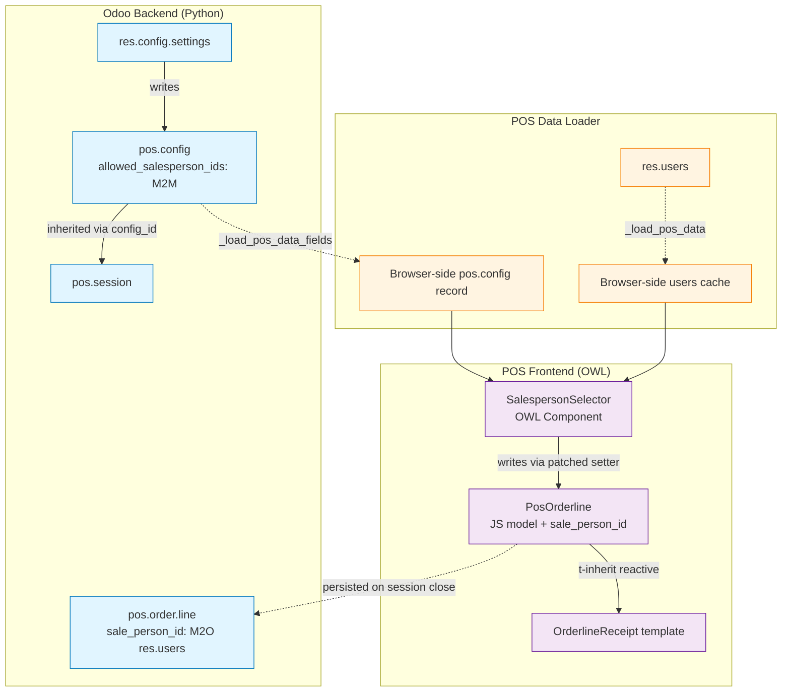
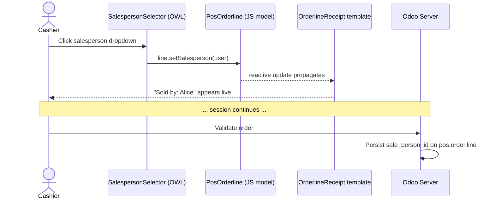

# Architecture — POS Per-Line Salesperson Tracking

## Component & Data Flow

---

## Lifecycle of One Order Line

---

## Why this layout

- **One source of truth per concern:** the M2M whitelist lives on `pos.config` (configuration), the assignment lives on `pos.order.line` (transaction). No duplication.
- **Data ships with bootstrap:** `_load_pos_data_fields` augments the existing POS payload — no extra round-trip per order.
- **OWL reactivity does the redraw:** the selector never calls `render()`. Writing to `props.line.sale_person_id` is enough because the receipt template reads from the same reactive proxy.
- **Patch composition:** `patch(PosOrderline.prototype, ...)` keeps the customization composable with other addons that may patch the same class.
