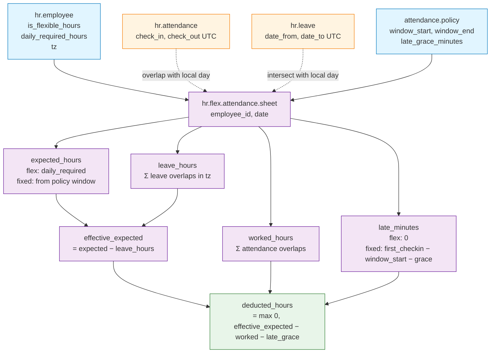
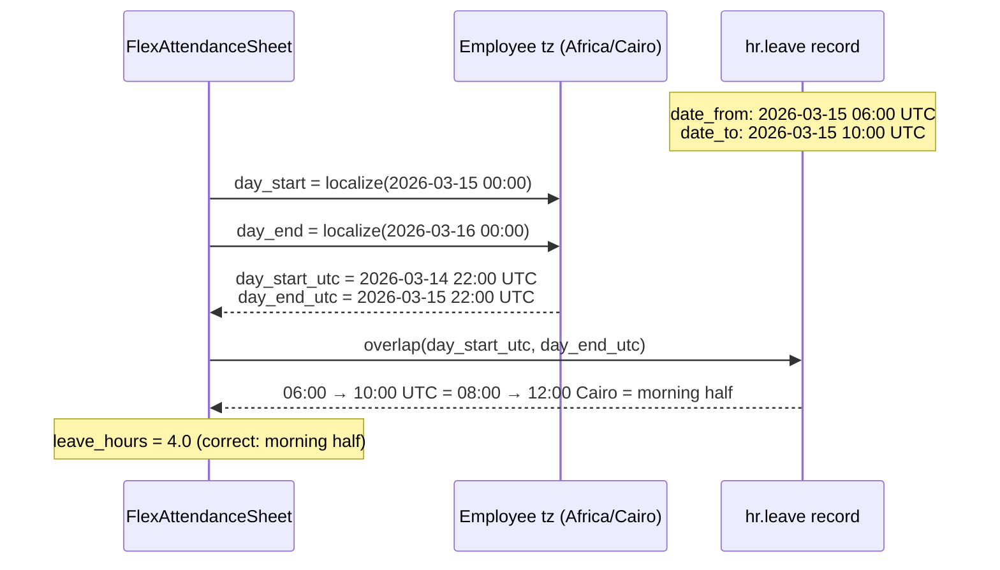

# Architecture — Half-Day Leave × Flexible Hours

## Data Model & Computation Chain

---

## The Timezone Interval Intersection

The core temporal operation — intersecting leave and attendance intervals with "today" in the employee's local time:

**Legacy bug:** `day_start` / `day_end` were computed in UTC, so `2026-03-15 00:00 UTC → 2026-03-16 00:00 UTC` was taken as "the day." For Cairo, that window actually spans **02:00 Cairo** on the 15th to **02:00 Cairo** on the 16th — a 24-hour slice offset by 2 hours from the real local day. For employees with a late-night flex window this pushed the leave into the *wrong* local day entirely.

---

## Why This Layout

- **Computed, not stored manually.** Every cell in the sheet is derived from source data — no data entry, no drift.
- **One day per record.** Matches the granularity of payroll computation. Aggregations happen at read time via Odoo's `read_group`.
- **Source-of-truth separation.** Policies configure, attendances/leaves record facts, sheets derive. No mutation flows backward.
- **Timezone handled at boundary computation only.** The business logic works in UTC; only the day-boundary lookup converts to local tz.
