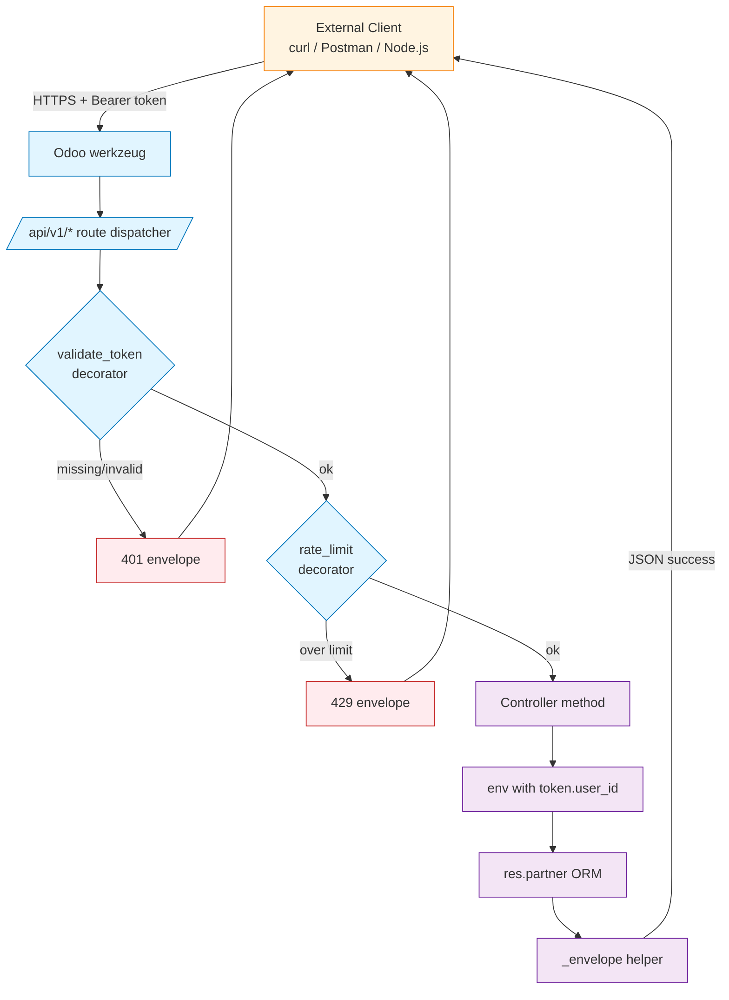
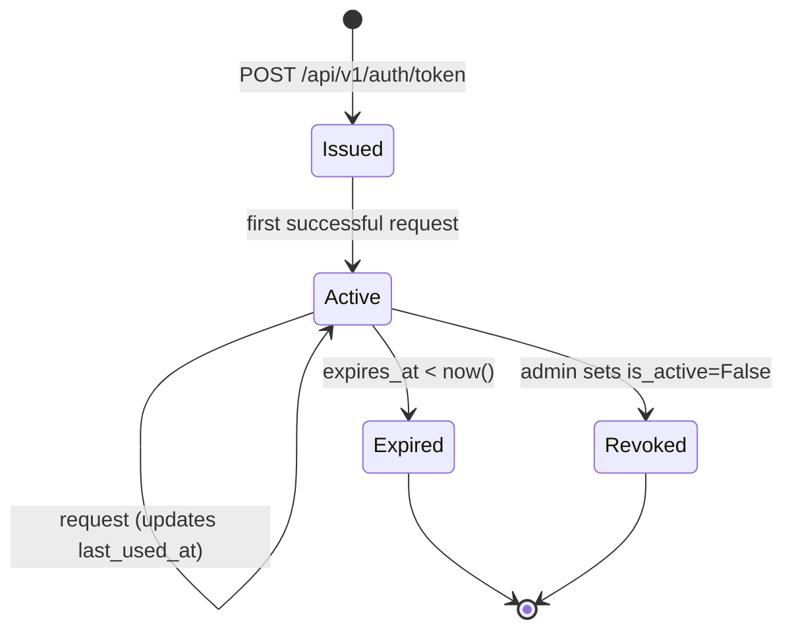

# Architecture — Partner Sync REST Gateway

## Request Lifecycle



---

## Token Lifecycle



---

## Module Layout

```
api_partner_gateway/
├── models/
│   └── api_token.py            api.token model (issue, validate, rate_limit)
├── controllers/
│   └── main.py                 /api/v1 routes + decorators + envelope helper
├── security/
│   └── ir.model.access.csv     admin-only on api.token
└── views/
    └── api_token_views.xml     backend CRUD for tokens
```

---

## Why This Layout

- **Tokens are a model, not config.** Every issued token is auditable — who, when, from where, last used.
- **Decorators compose.** `@validate_token` and `@rate_limit` each do one thing. Endpoints stay thin.
- **Envelope is a single function.** One place to enforce the response contract; adding fields later (e.g., `meta.request_id`) is a one-line change.
- **No `sudo()` sprinkling.** The token validation rebinds `self.env` to the token owner; endpoints use plain ORM from there on.
- **Rate limiter is swappable.** In-memory for the demo; swap to Redis by implementing the same `check_rate_limit(key)` interface.
