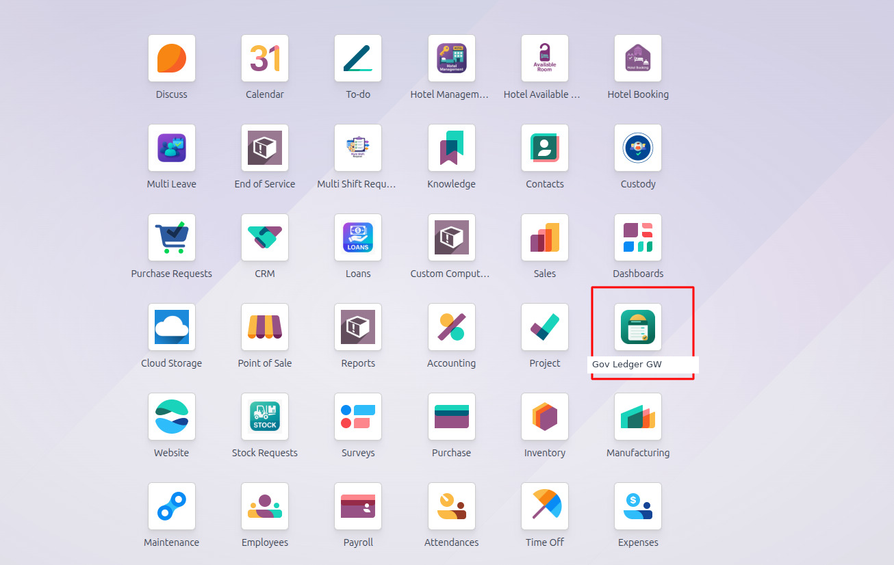
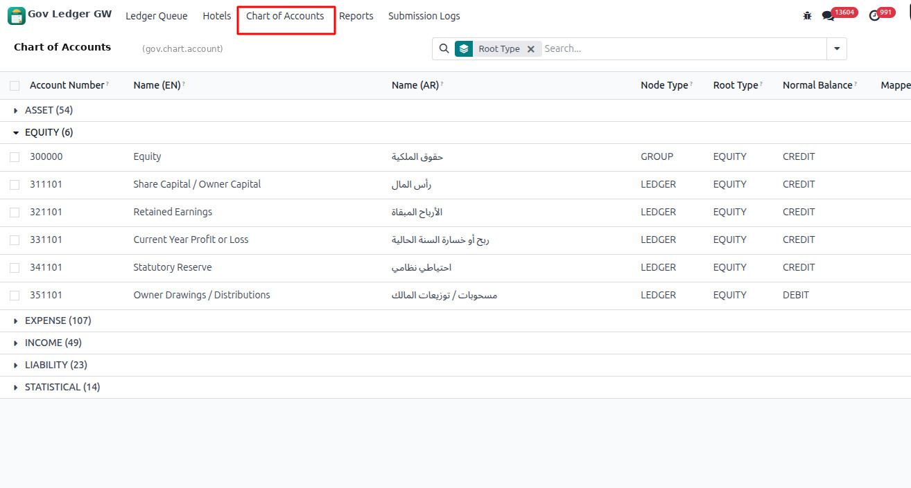
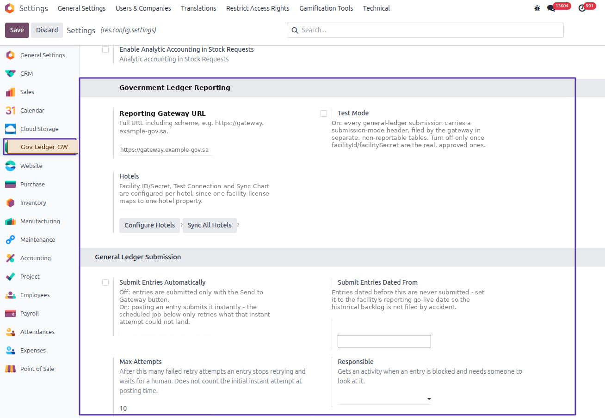
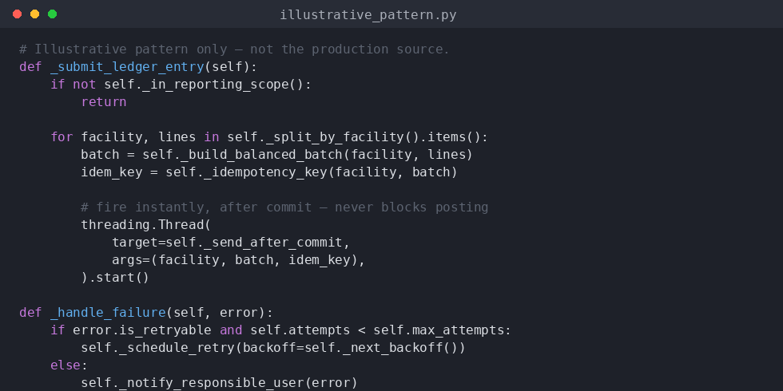

# Case Study 04 — Real-Time Government Ledger Reporting Gateway

> **Stack:** Odoo 18 · Python · OAuth2 client-credentials · HTTP
> **Fictional client:** _Dunes & Palm Hospitality Group_ — a multi-property boutique hotel group running several licensed properties on one shared Odoo instance.
> **Type:** Outbound compliance integration, built from scratch, plus the accounting-side data modeling to support it.

> ℹ️ **A note on this case study.** Unlike cases 01–03, this one is based on a real production integration I built for a hospitality client, reporting to a real national regulatory platform. The client, the platform, and every domain name shown are **fictionalized** for this write-up, and the screenshots below have the real names redacted. No source code is reproduced anywhere in this repo — only the architecture, the decisions, and one illustrative (rewritten) pseudocode pattern.

---

## For a business reader

A government tourism authority requires every licensed hotel to report its accounting data — chart of accounts and every general-ledger entry — to a central regulatory platform, in close to real time, for compliance and statistical oversight. Missing or late submissions are a compliance risk for the hotel's license.

The challenge wasn't "call an API." It was making that requirement work safely inside a live, multi-property hotel operation:

- The client runs **several hotel properties from one Odoo database**, and a single accounting entry can span more than one property. The government platform only accepts one property's data at a time, so the integration has to correctly split a shared entry before reporting it.
- "Real time" met the reality of **posting an invoice at the front desk while a guest is waiting** — the integration could not be allowed to freeze that screen while it talked to a government server that might be slow.
- The Ministry's own sandbox and production environments had to be kept **strictly separate**, so a setup mistake could never result in test data appearing as if it were a real filing — or, conversely, years of old entries getting reported by accident the day the integration went live.

The result: entries file themselves automatically the moment they're posted, a safety-net job catches anything that didn't land the first time, and every attempt is logged for audit — with no manual "click send" step required once the property is live.

## For a technical reader

**Problem.** Build an outbound reporting module that takes posted Odoo journal entries and submits them to an external government gateway (OAuth2 client-credentials auth, one credential pair per licensed facility), while:

1. **Splitting mixed entries.** Some journal entries post lines against more than one hotel property ("facility") in the same document. The gateway's API is single-facility per submission, so each entry has to be resolved line-by-line to its facility and, when it spans more than one, split into balanced per-facility batches before sending.
2. **Being instant without blocking.** Posting is a synchronous, user-facing action. The fix: fire the submission in a background thread immediately **after** the database commit, so a slow or unreachable gateway can never stall the UI or roll back a legitimately posted entry. A scheduled job runs alongside it purely as a **retry safety net** for whatever the instant attempt couldn't land — it is not a second "real" sender, which would risk double-submission races.
3. **Being safe to retry.** Every batch carries a deterministic idempotency key, so a retried submission after a timeout can never create a duplicate record on the government side.
4. **Failing loudly, not silently.** Failures are classified retryable (network blip, 5xx, rate limit) vs. terminal (an account with no mapping, a validation error). Retryable failures back off and requeue automatically up to a configurable attempt cap; once that cap is hit, the entry stops retrying and raises an activity to a named responsible user instead of failing silently forever.
5. **Never crossing test/production.** Every submission carries an explicit mode header. Test-mode traffic is physically routed to non-reportable tables on the gateway's side, and a configurable go-live date means historical entries predating the integration are never swept up and reported by accident.

---

## Constraints & Considerations

- **Payroll-grade correctness applies to ledger data too.** A submission has to be deterministic and auditable — every request/response pair is a queryable record, not just a boolean flag on the invoice.
- **One credential per license.** Each hotel property has its own facility ID/secret; they are never interchangeable, and a config error on one property must not be able to submit another property's data.
- **No UI-blocking network calls.** The accounting team must never feel the integration while posting entries.
- **A human is the backstop, not an infinite retry loop.** After N failed attempts, a person gets notified — the system doesn't retry forever or fail silently.
- **Minimal invented complexity.** An earlier version of this module had a separate account-mapping model with its own wizard, and an invented catalogue of error codes. Neither survived a later simplification pass — a single field on the account, and letting the gateway's own error codes pass through, did the same job with much less code to maintain.

---

## Architecture

See [`architecture.md`](./architecture.md) for the full diagram.

At a glance:

```
Journal entry posted
        │
        ▼
   In reporting scope?  (posted · dated after go-live · accounts mapped)
        │ yes
        ▼
   Resolve facility per line ──► single facility ──► one batch
        │
        └──► multiple facilities ──► split into balanced per-facility batches
        │
        ▼
   Build batch + idempotency key
        │
        ▼
   Fire in background thread, AFTER commit  ──►  Gateway
        │                                          │
        ▼                                          ▼
   success: mark sent + log              failure: classify
                                                    │
                                    retryable ──► backoff, requeue (cron safety net)
                                    terminal  ──► notify responsible user
```

---

## Key Technical Decisions

- **OAuth2 client-credentials, cached per facility.** The access token is fetched once and reused until it's near expiry — not re-requested on every submission.
- **Chart mapping is one field, not a subsystem.** The government platform has its own standard chart of accounts; each Odoo account maps to one government account number via a single field on `account.account`. An earlier version modeled this as a separate mapping model with its own wizard — removed once it was clear a field did the same job.
- **Instant send runs in a background thread, after commit.** Guarantees the posted entry is durable in the database regardless of what the gateway does next, and that the UI never waits on an external HTTP call.
- **The scheduled job is a safety net, not the sender.** It only retries what the instant attempt could not land, avoiding a race where both the instant path and the cron try to submit the same entry.
- **Idempotency key per batch.** Derived deterministically from the entry and facility, so retried submissions are safe to replay on the gateway's side.
- **Explicit test/production mode header on every request**, with a configurable "submit entries dated from" cutoff, so onboarding a new property can never accidentally report its historical backlog.
- **Retryable vs. terminal failure classification**, so a validation error doesn't get silently retried 10 times while a genuine network blip does.

---

## Illustrative Snippets

See [`snippets.md`](./snippets.md) and the code screenshot below — a rewritten, generic version of the send/retry pattern. Not the production source.

---

## Screenshots

| Screenshot | What it shows |
|---|---|
|  | The integration's entry point in the main Odoo app menu |
|  | The government-side chart of accounts, each node mapped to the standard COA |
|  | Gateway URL, test-mode switch, instant-submission toggle, retry/backoff and go-live-date configuration |
|  | Illustrative (rewritten) code pattern for the instant-send + retry logic — not the real source |

---

## What I Learned

> The interesting part of this integration wasn't the HTTP call — it was translating "must be instant" from a compliance requirement into an architecture that's actually safe: an immediate best-effort attempt that never blocks the user, backed by a durable, idempotent retry path for everything that didn't land the first time.

Three takeaways:

1. **"Real-time" for an external, unreliable system means "instant primary attempt + durable retry," not "literally synchronous."** Treating the two as the same thing is the mistake that leads to blocking UIs or silently dropped submissions.
2. **Splitting a single accounting document across multiple downstream recipients is a data-modeling problem before it's an integration problem.** Getting the facility-resolution and balanced-split logic right up front made the actual HTTP layer straightforward.
3. **Cutting an over-modeled abstraction (the mapping wizard, the invented error catalogue) made the module more correct, not less** — fewer moving parts meant fewer places for the retry/idempotency logic to disagree with itself.

---

## Want to Talk Through This One?

This integration reports to a live production government system for a real client, so — unlike cases 01–03 — the full source isn't available even privately. I'm glad to walk through the architecture, the decisions above, and the code screenshot live in an interview.
