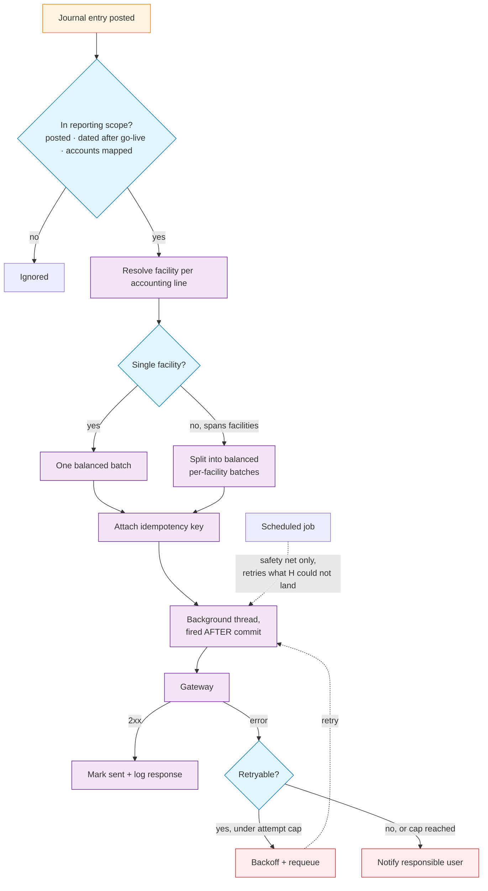
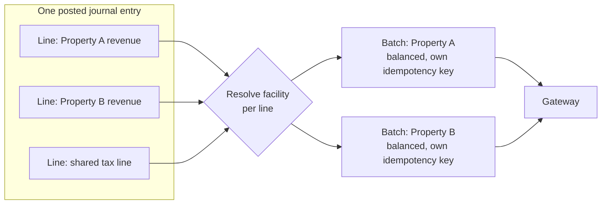
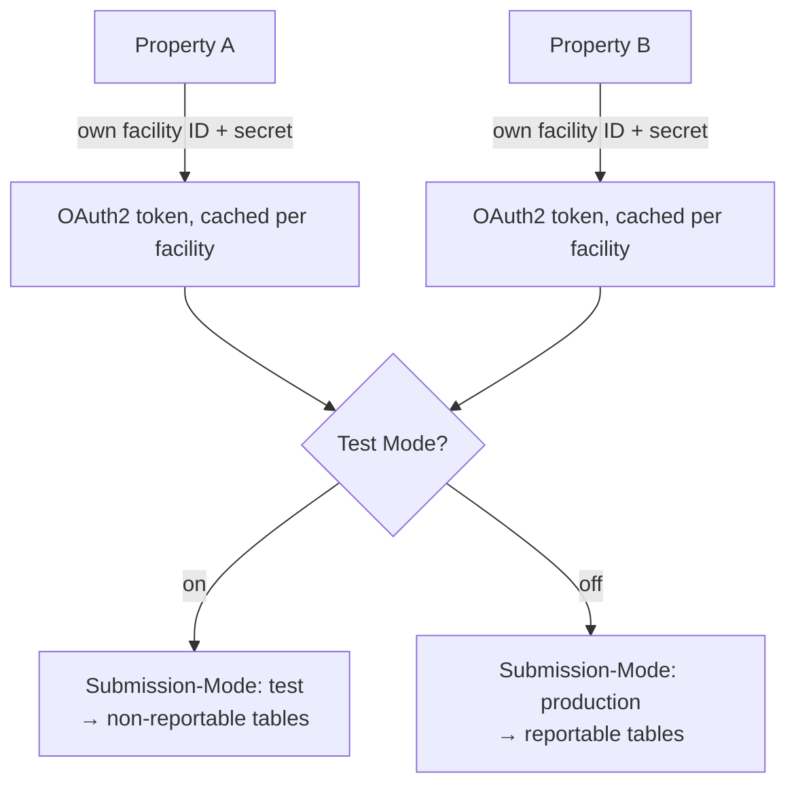

# Architecture — Real-Time Government Ledger Reporting Gateway

## Submission Lifecycle



---

## Facility Split — Why a Single Entry Can Become Several Batches



A shared line (e.g. a tax or discount line not tied to one property) is allocated across the facilities it affects before the batches are built, so each outgoing batch is independently balanced — the gateway rejects anything that doesn't net to zero.

---

## Credential & Environment Model



Credentials, tokens, and the test/production mode are all scoped per property — a misconfiguration on one facility cannot leak into another, and flipping test mode off is the explicit, deliberate step that makes a facility's submissions count for real.

---

## Module Layout (illustrative — generic names, not the real module)

```
gov_ledger_reporting_gateway/
├── models/
│   ├── gateway_client.py        OAuth2 token fetch/cache, HTTP client, envelope handling
│   ├── account_move.py          scope check, facility split, batch build, send, retry, failure handling
│   ├── account_account.py       one field: mapped government account number
│   └── submission_log.py        durable, queryable record of every request/response
├── data/
│   └── ir_cron.xml              safety-net retry job only
├── security/
│   └── ir.model.access.csv
└── views/
    ├── res_config_settings_views.xml   gateway URL, test mode, instant-send, retry config
    └── submission_log_views.xml
```

---

## Why This Layout

- **The send/retry state machine lives on the document being sent** (`account_move`), not in a separate service object — the entry's own state (sent / pending / failed) is always consistent with what's actually happened to it.
- **The HTTP client is a thin, swappable layer.** Token caching and request/response shaping live in one place, so the retry logic never has to know about OAuth mechanics directly.
- **The submission log is append-only and queryable** — every attempt, not just the latest one, so a support conversation about "did entry X get filed" is a lookup, not a guess.
- **Facility resolution is computed once per entry, before any network call** — the split decision is pure data logic, independently testable without a live (or mocked) gateway.
